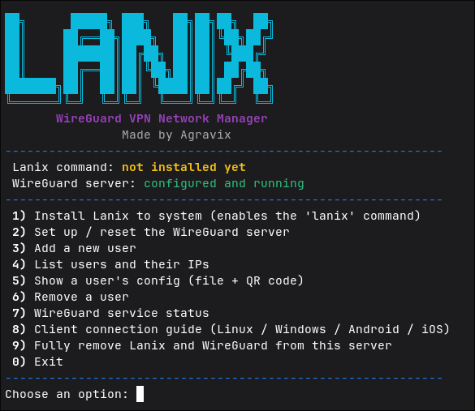

# Lanix

**Lanix** is an interactive WireGuard VPN network manager for Linux servers (VPS). It turns a bare VPS into a private virtual network hub in a few minutes — install it, add your users, and share the generated config files (or QR codes) with them.

Made by **Agravix**.

---

## Screenshot



---

## Features

- One-command install as a system-wide `lanix` command
- Interactive, color menu — no need to memorize commands
- Full CLI mode as well, for scripting or manual/advanced use
- Automatically installs and configures WireGuard on the server
- Add / remove users at any time, each with their own name and internal IP
- Generates a ready-to-use `.conf` file **and** a QR code for every user (great for mobile — just scan and connect)
- Built-in connection guide for Linux, Windows, Android, and iOS clients
- Live service status and peer status view
- Clean, complete uninstall option

---

## Requirements

- A Linux VPS (Ubuntu/Debian, CentOS/RHEL/Fedora, or similar)
- Root access (`sudo`)
- Outbound internet access on the server (to install packages and detect its public IP)
- An open **UDP** port (default `51820`) in your VPS provider's firewall / security group

---

## Quick Install (curl)

Run this on your VPS as root or with `sudo`:

```bash
curl -fsSL https://raw.githubusercontent.com/Agravix/lanix/main/lanix.sh -o lanix.sh
sudo bash lanix.sh
```

The first time it runs, open the menu and choose:

1. **Install Lanix to system** — registers the `lanix` command so you never have to run the script manually again.
2. **Set up / reset the WireGuard server** — installs WireGuard, configures the server, and asks how many users you want to create right away.

After that, just run:

```bash
sudo lanix
```

### One-liner (install + open menu)

```bash
curl -fsSL https://raw.githubusercontent.com/Agravix/lanix/main/lanix.sh | sudo bash
```

> Note: since this script needs interactive input (menu choices, names, etc.), running it via a pipe still works, but make sure your terminal supports interactive `read` prompts when piping (most do). If you prefer a safer, auditable install, use the two-step method above (download, inspect, then run).

---

## Manual Install (git clone)

```bash
git clone https://github.com/Agravix/lanix.git
cd lanix
sudo bash lanix.sh
```

---

## Usage

### Interactive menu

```bash
sudo lanix
```

The menu adapts automatically:
- The **"Install Lanix to system"** option only appears if it hasn't been installed as a command yet — once installed, it disappears from the menu.
- Current status (whether the `lanix` command and the WireGuard server are set up) is always shown at the top.

Menu options include:

| Option | Description |
|---|---|
| Install Lanix to system | Registers the `lanix` command (shown only if not already installed) |
| Set up / reset the WireGuard server | Installs WireGuard and configures the server |
| Add a new user | Creates a new peer with a name you choose |
| List users and their IPs | Shows all registered users and their internal IPs |
| Show a user's config | Prints the `.conf` file and a scannable QR code |
| Remove a user | Deletes a peer by name |
| WireGuard service status | Shows `systemctl` and `wg show` output |
| Client connection guide | Step-by-step setup for Linux / Windows / Android / iOS |
| Fully remove Lanix and WireGuard | Complete uninstall |

### CLI mode (manual / scripted)

Every action is also available directly from the command line:

```bash
sudo lanix install          # install dependencies and set up the server
sudo lanix install-cmd      # install just the 'lanix' command, no server setup
sudo lanix add <name>       # add a new user
sudo lanix remove <name>    # remove a user
sudo lanix list             # list all users and their internal IPs
sudo lanix show <name>      # show a user's config file and QR code
sudo lanix status           # show service and peer status
sudo lanix guide            # show the client connection guide
sudo lanix uninstall        # remove Lanix and WireGuard entirely
```

---

## Connecting a Client

After adding a user, run `sudo lanix show <name>` to get:

- A `.conf` file you can copy to a Linux or Windows machine and import into WireGuard
- A QR code you can scan directly with the WireGuard app on Android/iOS

Basic steps per platform:

**Linux**
```bash
sudo apt install wireguard -y
sudo cp <name>.conf /etc/wireguard/wg0.conf
sudo wg-quick up wg0
sudo systemctl enable wg-quick@wg0
```

**Windows**
1. Install the official app from [wireguard.com/install](https://www.wireguard.com/install/)
2. "Import tunnel(s) from file" → select the `.conf` file
3. Click "Activate"

**Android / iOS**
1. Install the WireGuard app from the Play Store / App Store
2. Tap "+" → "Scan from QR code"
3. Scan the QR code shown by `sudo lanix show <name>`
4. Turn the tunnel on

Once everyone is connected, each user has a fixed internal IP (e.g. `10.10.10.2`, `10.10.10.3`, ...) and can reach each other directly through that IP.

---

## Uninstalling

```bash
sudo lanix uninstall
```

This stops and removes the WireGuard service, deletes all configuration and user data, and (optionally) removes the underlying packages and the `lanix` command itself.

---

## License

MIT — feel free to fork, modify, and use.

---

Built with ❤️ by **Agravix**.
